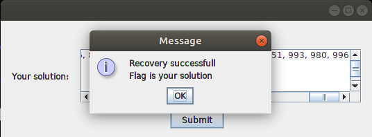

# Hint
Could you help me recovery my number? 
File: recovery 
Note: The flag is not in flag format, please wrap it in format when you submit. ISITDTU{x, y, z, ...} 
Update: "Pre-order"

# Code
```java
class FrmProblem extends JFrame {
  private void btnSubmitActionPerformed(ActionEvent evt) {
    try {
      String txtInputS = this.txtInput.getText().trim();
      String[] str = txtInputS.split(",");
      int[] input = new int[str.length];
      
      for (int i = 0; i < str.length; i++) {
        input[i] = Integer.parseInt(str[i].trim());
      }
      int[] s = { 9, 11, 33, 35, 38, 40, 44, 48, 61, 85, 89, 101, 106, 110, 135, 150, 159, 180, 188, 200, 201, 214, 241, 253, 268, 269, 275, 278, 285, 301, 301, 327, 356, 358, 363, 381, 396, 399, 413, 428, 434, 445, 449, 462, 471, 476, 481, 492, 496, 497, 509, 520, 526, 534, 540, 589, 599, 613, 621, 621, 623, 628, 634, 650, 652, 653, 658, 665, 679, 691, 708, 711, 716, 722, 752, 756, 764, 771, 773, 786, 807, 808, 826, 827, 836, 842, 856, 867, 875, 877, 879, 889, 892, 922, 946, 951, 965, 980, 993, 996 };
      int[] l = { 35, 33, 44, 40, 38, 48, 11, 85, 89, 61, 110, 150, 159, 135, 188, 200, 180, 106, 101, 214, 268, 275, 269, 253, 241, 201, 9, 301, 301, 285, 327, 356, 363, 396, 413, 399, 445, 434, 462, 449, 428, 471, 481, 492, 496, 497, 476, 381, 358, 278, 534, 526, 520, 613, 599, 623, 621, 621, 589, 540, 628, 650, 653, 652, 665, 691, 679, 711, 756, 752, 722, 716, 807, 786, 773, 771, 826, 808, 827, 764, 856, 875, 867, 842, 836, 708, 879, 892, 889, 922, 877, 951, 946, 658, 980, 996, 993, 965, 634, 509 };
      
      if (check(s, (new CTF_Problem()).getResultA(input))) {
        if (check(l, (new CTF_Problem()).getResultB(input))) {
          
          JOptionPane.showMessageDialog(this.rootPane, "Recovery successfull\nFlag is your solution");
        } else {
          JOptionPane.showMessageDialog(this.rootPane, "Wrong answer! Try angain...");
        } 
      } else {
        JOptionPane.showMessageDialog(this.rootPane, "Wrong answer! Try angain...");
      } 
    } catch (Exception ex) {
      JOptionPane.showMessageDialog(this.rootPane, "Wrong answer! Try angain...");
    } 
  }
}

class CTF_Prolem
{
  public int[] getResultB(int[] a) {
    CTF_Problem b = new CTF_Problem();
    l = m = 0;
    for (int i = 0; i < arr2.length; i++) {
      b.insert(a[i]);
    }
    b.postOrder(root);
    return arr2;
  }

  public int[] getResultA(int[] a) {
    CTF_Problem b = new CTF_Problem();
    l = m = 0;
    for (int i = 0; i < arr1.length; i++) {
      b.insert(a[i]);
    }
    b.inOrder(root);
    return arr1;
  }

  public void inOrder(Node root) {
    if (root != null) {
      inOrder(root.left);
      arr1[l++] = root.data;
      inOrder(root.right);
    } 
  }
  
  void postOrder(Node node) {
    if (node == null) {
      return;
    }
    postOrder(node.left);
    postOrder(node.right);
    arr2[m++] = node.data;
  }
}
```

# Solution
Calculate pre-order from in-order and post-order, run script
> python crack.py

We get result:
```
509, 278, 9, 201, 101, 61, 11, 48, 38, 33, 35, 40, 44, 89, 85, 106, 180, 135, 110, 159, 150, 200, 188, 241, 214, 253, 269, 268, 275, 358, 356, 327, 285, 301, 301, 381, 363, 476, 471, 428, 399, 396, 413, 449, 434, 445, 462, 497, 496, 492, 481, 634, 628, 540, 520, 526, 534, 589, 621, 599, 613, 621, 623, 965, 658, 652, 650, 653, 946, 877, 708, 679, 665, 691, 836, 764, 716, 711, 722, 752, 756, 827, 808, 771, 773, 786, 807, 826, 842, 867, 856, 875, 922, 889, 879, 892, 951, 993, 980, 996
```
flag is `ISITDTU{509, 278, 9, 201, 101, 61, 11, 48, 38, 33, 35, 40, 44, 89, 85, 106, 180, 135, 110, 159, 150, 200, 188, 241, 214, 253, 269, 268, 275, 358, 356, 327, 285, 301, 301, 381, 363, 476, 471, 428, 399, 396, 413, 449, 434, 445, 462, 497, 496, 492, 481, 634, 628, 540, 520, 526, 534, 589, 621, 599, 613, 621, 623, 965, 658, 652, 650, 653, 946, 877, 708, 679, 665, 691, 836, 764, 716, 711, 722, 752, 756, 827, 808, 771, 773, 786, 807, 826, 842, 867, 856, 875, 922, 889, 879, 892, 951, 993, 980, 996}`

# Input to program to verify
